# SOCIAL NETWORK

```
## Project Description:
Build a social networking website with many basic functions
## Tech Stack Used:
```bash
    - Frontend: ReactJS, HTML , CSS (Tailwind CSS,SASS,Material UI) , Redux Toolkit
    - Backend: Java (Spring Boot), MySql
```
## Website Functions:
```bash
    * Users can add/remove other users
    * Can search for users or posts by keyword
    * Can post content, photos or videos (maximum 2 photos/video)
    * You can comment on posts, like, edit and delete comments
    * Can message users who have made friends (real time)
    * Display notifications for posting, adding friends,...
    * View other users personal pages
    * Show friend suggestions
    * Edit users personal information
    * Basic Login/Register
    * View friends list, all posted photos
```
## Some features of the site:
Home Page                   |                   Friend request
:---------------------------------:        |      :------------------------------:
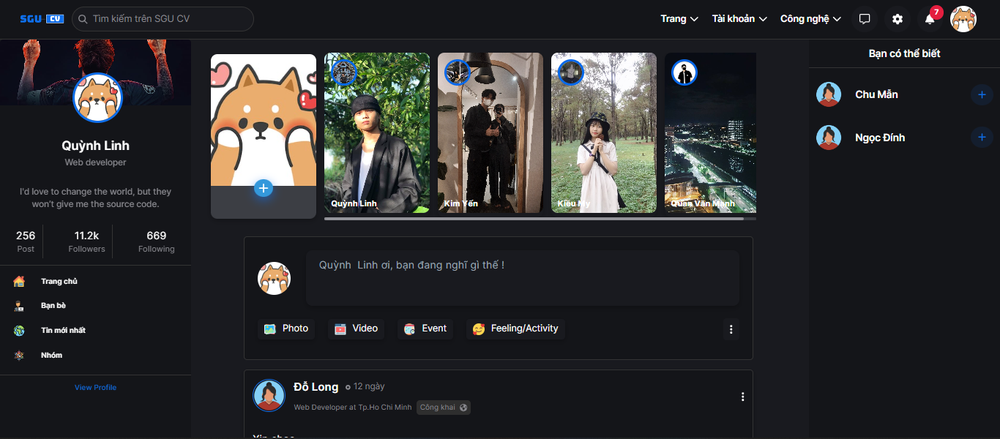  | 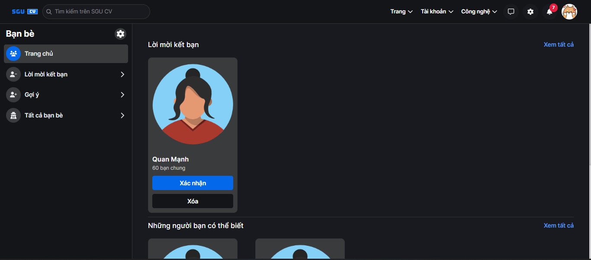

Confirm Page                   |                   Suggest Page
:---------------------------------:        |      :------------------------------:
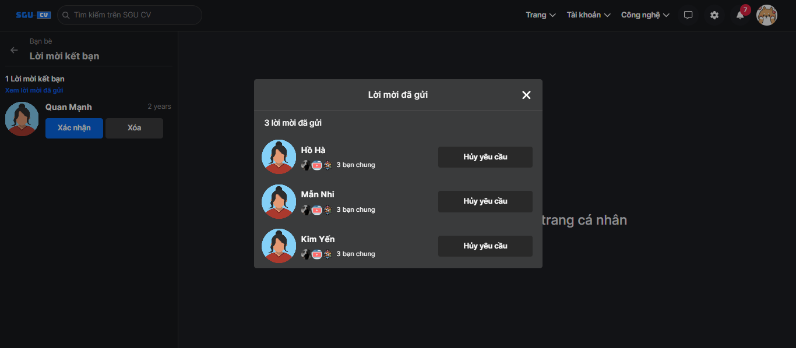  | 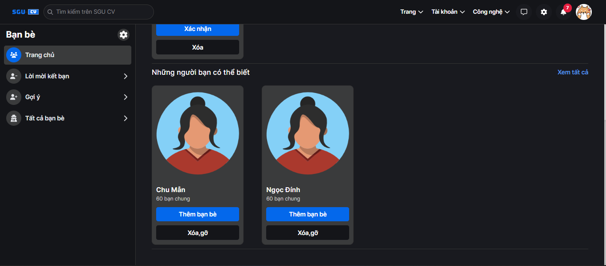

Post                   |                   Comments
:---------------------------------:        |      :------------------------------:
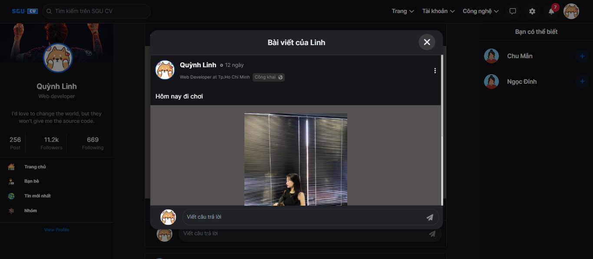  | 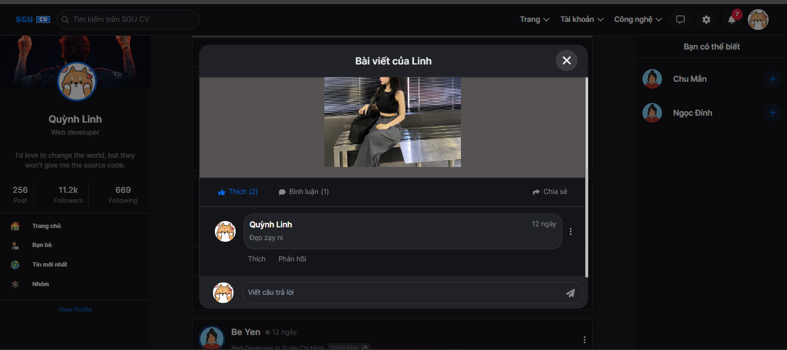

Profile                   |                   Profile
:---------------------------------:        |      :------------------------------:
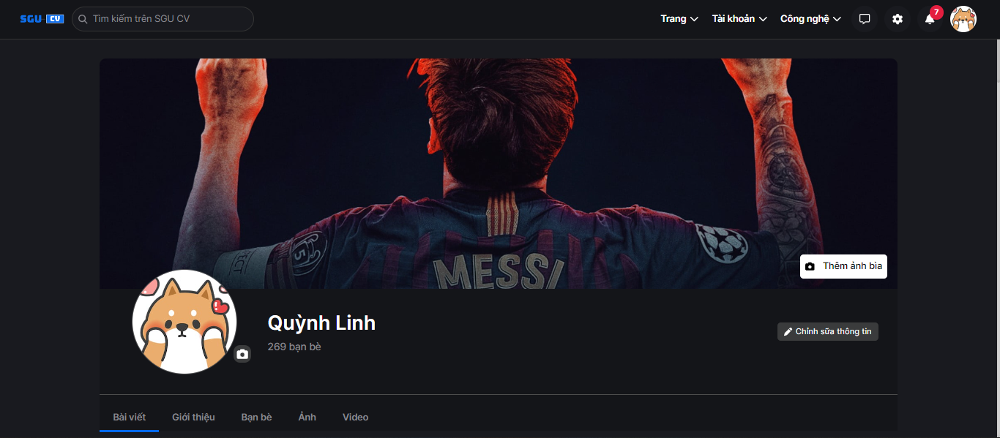  | 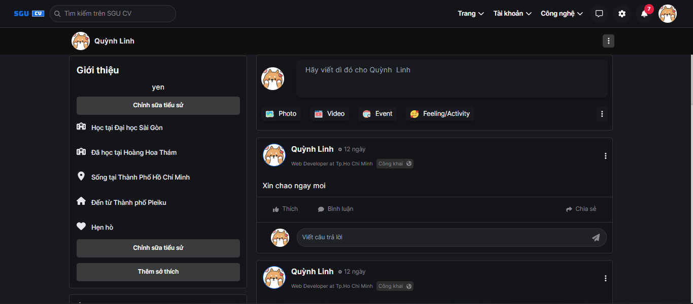

Lists Friends                   |                   Edit
:---------------------------------:        |      :------------------------------:
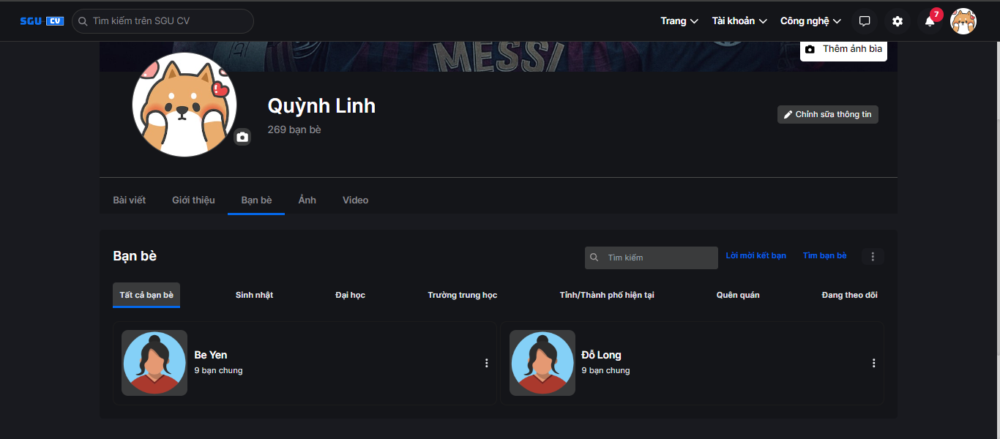  | 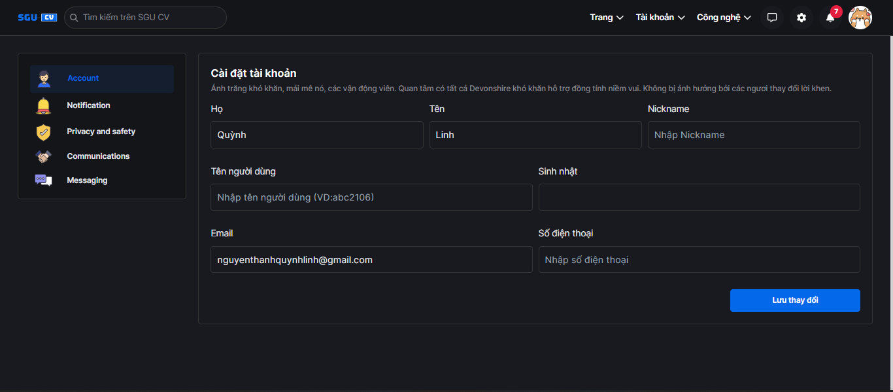

Notify                   |                   Message
:---------------------------------:        |      :------------------------------:
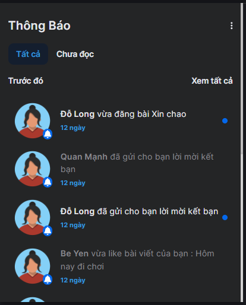  | 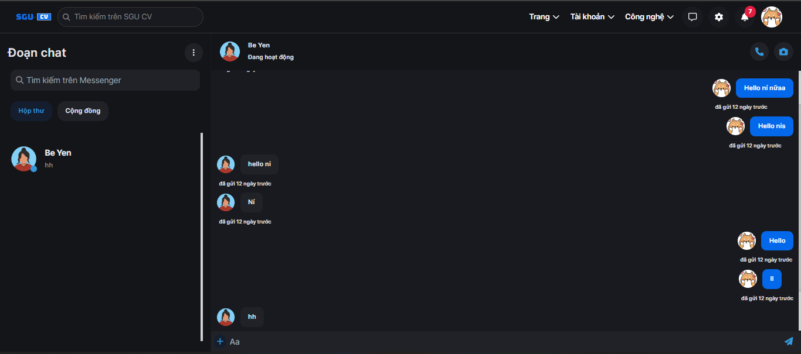

### Make sure to star the repository if you find it helpful!
<a href="https://github.com/hien910/SocialNetwork/stargazers"></a>
